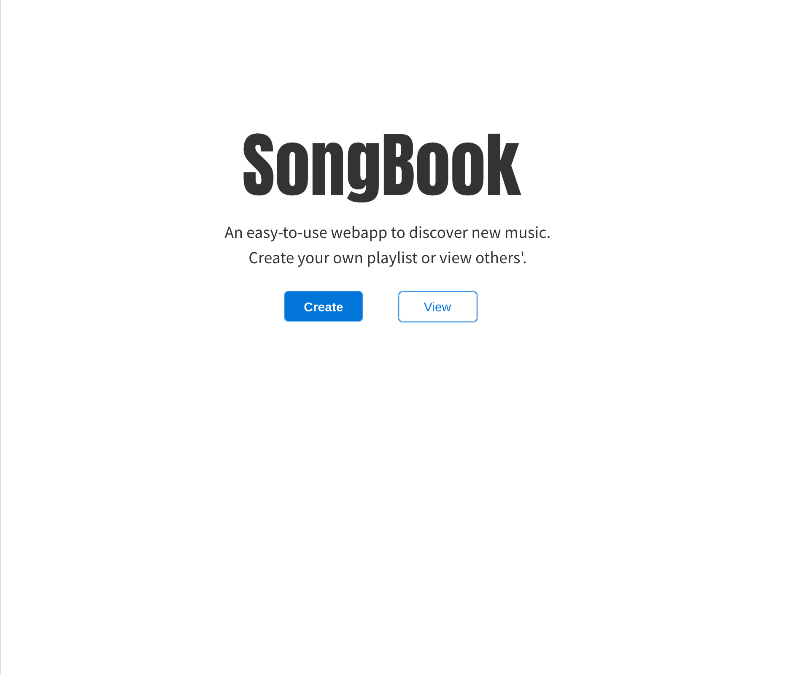
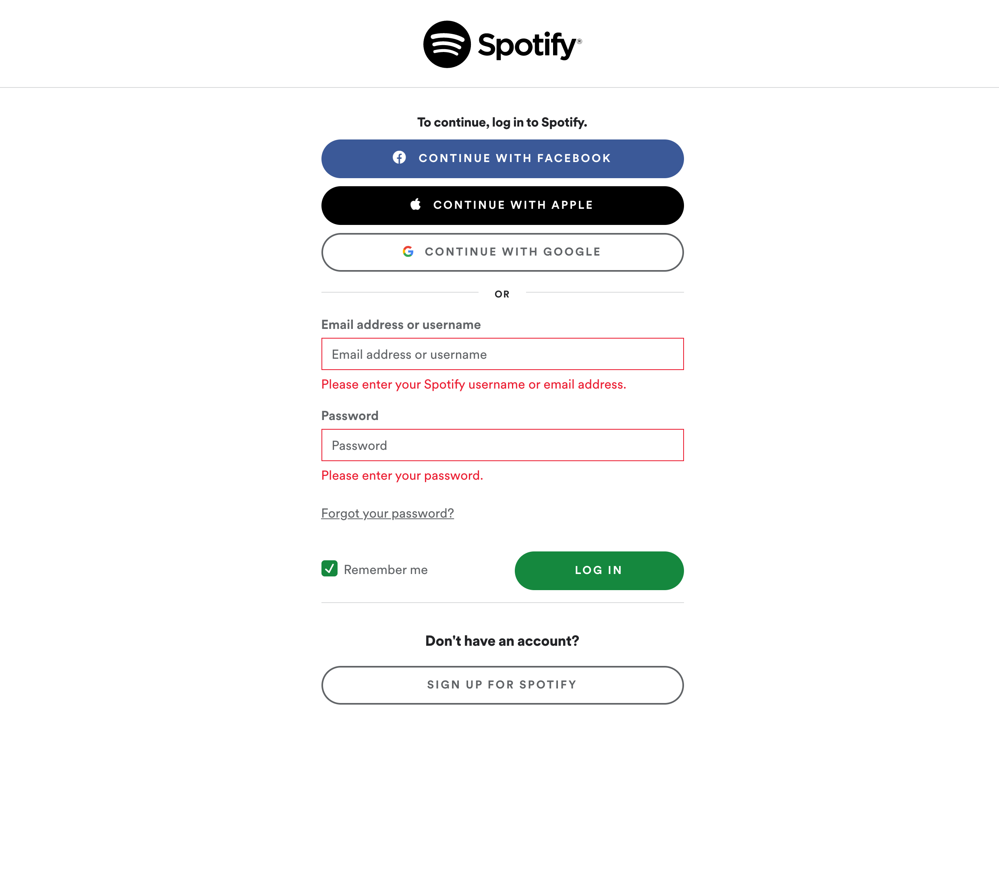
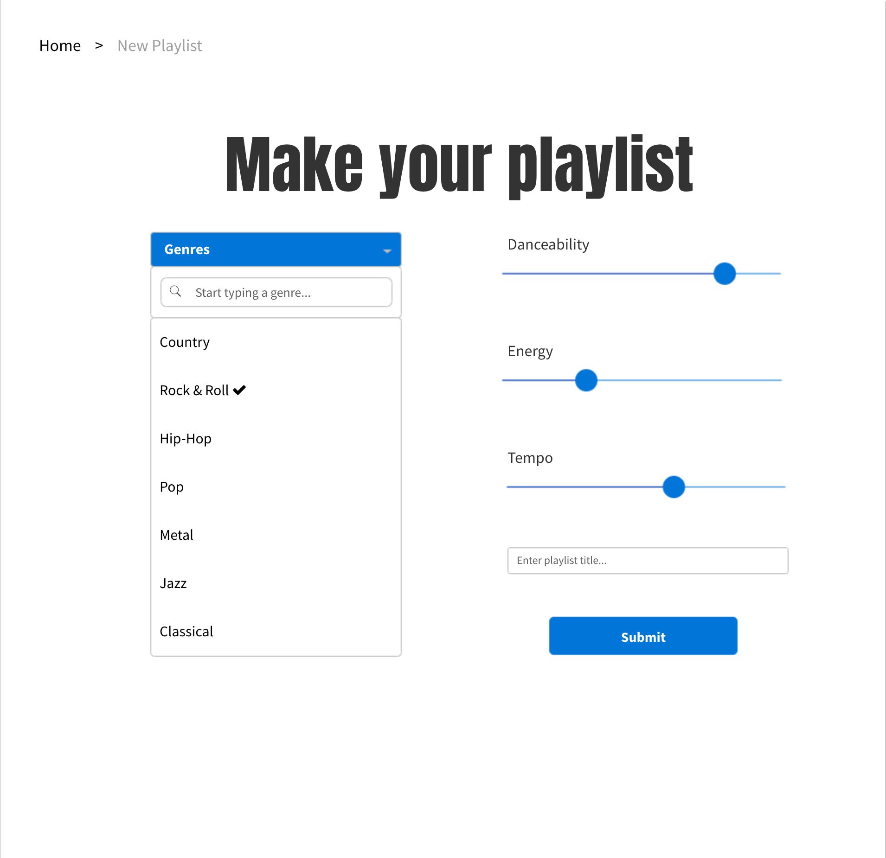
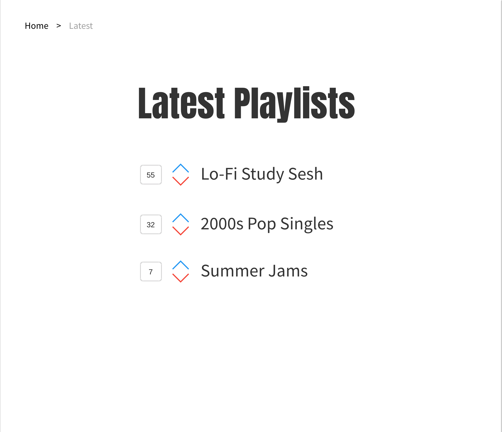

# SongBook

## Description

A simple webapp that integrates with Spotify to let users create and discover novel playlists.

## User Story

As a user, I want to:

- discover new music that I wouldn't find otherwise
- save my newly created playlists to my spotify account
- view others' playlists and upvote/downvote

## APIs Used

- [Spotify Web API](https://developer.spotify.com/documentation/web-api/)

## Rough task breakdown

- API queries and Spotify integration -> Zach
- Database and sequelize -> Megan & Pablo
- Views and frontend JS -> Nick

## Wireframe

### Homepage

### Login

### Create New Playlist

### View Existing Playlists

